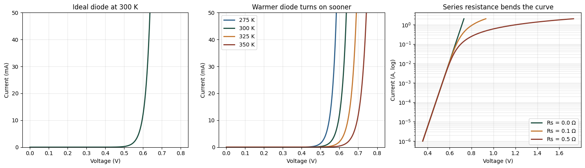

# Silicon Diode I–V Characteristics

A numerical model of current flow through a silicon p-n junction, its
temperature dependence, and the effect of series resistance.

## Result

**Panel 1 — Ideal diode at 300 K.**
Current is modeled from 0 to 0.8 V at room temperature. The curve rises
exponentially, with no threshold term anywhere in the equation. On a
linear current axis current appears negligible until roughly 0.5–0.6 V
and then climbs steeply, which is where the familiar "0.6 V turn-on
voltage" rule of thumb comes from. This is an artifact of plotting an
exponential on linear axes, not a physical switching point.

**Panel 2 — Temperature dependence.**
The same characteristic is plotted at 275, 300, 325, and 350 K. The
curves shift toward lower voltage as temperature rises — 350 K is
leftmost, 275 K rightmost. A warmer diode reaches any given current at a
smaller applied voltage. At a fixed 10 mA the model requires 0.645 V at
275 K but only 0.494 V at 350 K.

Fitting forward voltage against temperature at that fixed 10 mA gives

    dV_f/dT = −2.02 mV/K

consistent with the accepted value for silicon of roughly −2 mV/K.
(The coefficient is fitted numerically; the panel shows the shift
qualitatively.)

The negative sign comes from two competing temperature effects. The
thermal voltage V_T = kT/q rises with temperature, which alone would
require a *higher* forward voltage to hold current constant. But the
saturation current I_S rises far more steeply, since I_S ∝ n_i² and
n_i² ∝ T³·exp(−E_g/kT). The I_S term dominates, so forward voltage must
fall. Because E_g/q is the largest term in the analytical expression for
dV_f/dT, this coefficient is effectively an indirect measurement of the
silicon band gap.

**Panel 3 — Effect of series resistance.**
Current is plotted on a logarithmic axis for series resistance values of
0.0, 0.1, and 0.5 Ω. On log axes the ideal (Rs = 0) case is a straight
line, the clearest visual confirmation of the exponential form.

All three curves coincide at low current, where the I·Rs drop is
negligible next to the junction voltage. Above roughly 10 mA the
finite-resistance curves bend away and flatten, because an increasing
share of the applied voltage is dropped across the series resistance
rather than the junction. Larger Rs bends the curve earlier and harder.
In this regime the junction is no longer the limiting element and the
device behaves ohmically — a departure the ideal Shockley equation does
not capture on its own.

## What this does

This models how much voltage is needed to drive a given current through a silicon p-n junction, and how that changes with temperature and series resistance.

## The physics

The Shockley diode equation relates current to applied voltage:

I = I_S · ( exp( V / (n·V_T) ) − 1 )

where V_T = kT/q is the thermal voltage (about 25.9 mV at room temperature)
and I_S is the reverse saturation current.

[Why is the relationship exponential?]

Electron energies follow a Boltzmann distribution, so the fraction with enough energy to cross the junction barrier falls off exponentially with barrier height. Forward voltage lowers that barrier, so the number of carriers crossing rises exponentially with applied voltage.

[What does the −1 term do?]

Without the −1, the equation would predict current flowing with zero voltage applied. A free energy machine. The −1 makes them cancel exactly.

[Why does a diode conduct almost nothing until about 0.6 V?]

0.6V is the volatge required for the electrons to overcome the depletion region and flow through the diode. Rearranging the diode equation shows that multiplying the current by a factor of ten costs about 60 mV of additional forward voltage. Moving from picoamps of background leakage to milliamps of operating current spans nine factors of ten. Multiplying nine factors of ten by 60 mV yields 540 mV, or about 0.54 V. Because of this, a diode with a larger initial leakage current requires fewer factors of ten to reach operating current, which causes it to turn on at a lower voltage. 
The saturation current depends strongly on temperature:

I_S(T) = I_S(T_ref) · (T/T_ref)³ · exp[ (E_g/nk) · (1/T_ref − 1/T) ]

[Why does heating a semiconductor free more carriers? What role is the
bandgap playing?]

Electrons in silicon are bound and can't conduct until they absorb enough energy to cross the bandgap — 1.12 eV. Thermal energy at room temperature is only ~0.026 eV, so only electrons in the high tail of the energy distribution make it. therefore when temperature increases energy of electrons increases freeing exponentially more carriers.

[Why does the diode turn on at a LOWER voltage when it's hotter, even
though you might expect more resistance?]

Temperature affects the required voltage in two competing ways. As the diode gets hotter, thermal voltage rises by 17%, which on its own would require a higher voltage. However, the background leakage current grows so rapidly that it shrinks the logarithmic part of the equation by 29%. Since the second effect dominates, the net result is that forward voltage falls at −2.02 mV/K.

## What I learned

- [unlike metal where higher temperature rather increases the resistance, in diode, higher temperature lowers the voltage required to have electrons flow thorugh. lowering resistance. ]
- [thermal energy increases the probability of a charge having enough energy to cross a barrier of height ]

---
Aaron Suh
